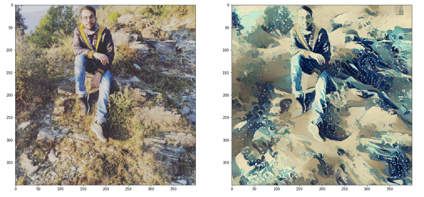

# Style-Transfer

Original and resulting image:

Image used as for style:

## How to use it
- Clone/Fork the project
- Run Jupyter Notebook
- Put your own images into `./images` folder
- Increase/Decrease number of epocs to increase the style effect or increase the style weight (beta). 

[Link](https://arxiv.org/pdf/1508.06576.pdf) to the research paper.
