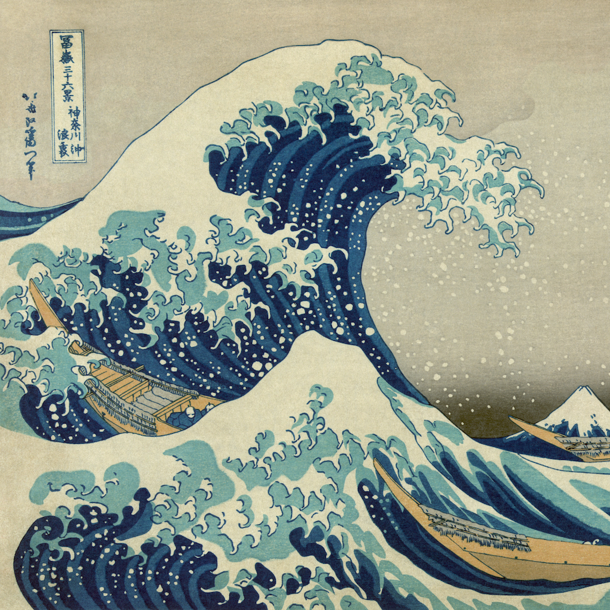

# Style-Transfer

This repo contains PyTorch implementation of [A Neural Algorithm of Artistic Style](https://arxiv.org/pdf/1508.06576.pdf)

I used conv1_1, conv2_1, conv3_1, conv4_1 and conv5_1 of the original VGG16 network for style reconstruction
and conv4_2 for the content reconstruction of the input images.

## Original and resulting image:

## Image used for the style

## How to use it
- Clone/Fork the project
- Run Jupyter Notebook
- Put your own images into `./images` folder
- Increase/Decrease number of epocs to increase the style effect or increase the style weight (beta). 

[Link](https://arxiv.org/abs/1508.06576) to the research paper.
